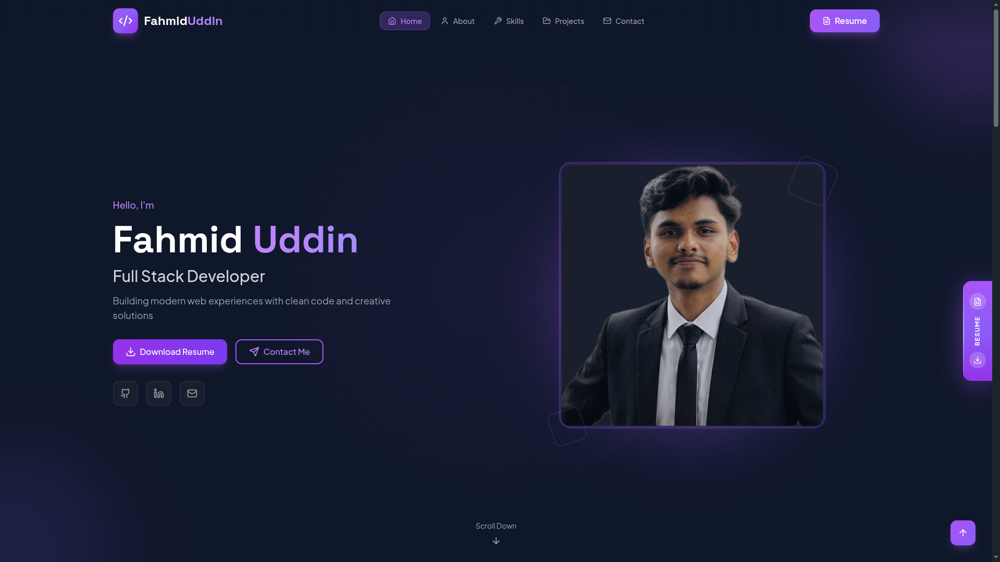

# Personal Portfolio Website

A modern, responsive, and interactive developer portfolio built with **React**, **TypeScript**, **Tailwind CSS**, and **DaisyUI**. It showcases my skills, projects, education, and experience while providing a seamless way for visitors to get in touch.

> Designed with a clean UI, smooth animations, and a mobile-first approach.

---

## ✨ Live Demo

🔗 **Website:** https://fahmid-folio-jet.vercel.app/

---

## Preview

---

#  Features

* 🎨 Modern dark-themed UI
* 📱 Fully responsive design
* ⚡ Fast performance with Vite
* ✨ Smooth animations using Framer Motion
* 🧩 Modular and reusable components
* 📂 Interactive project showcase
* 🔍 Project details displayed in a modal
* 📄 One-click resume download
* 📬 Working contact form powered by EmailJS
*  SEO-friendly metadata
* ♿ Accessible and semantic HTML
* 🌙 Beautiful typography and clean layouts

---

# 🛠️ Tech Stack

### Frontend

* React
* TypeScript
* Vite
* Tailwind CSS
* DaisyUI
* Framer Motion

### Form Handling

* React Hook Form

### Email Service

* EmailJS

### Icons

* React Icons
* Lucide React

### Notifications

* React Hot Toast

# 📱 Responsive Design

The portfolio is optimized for:

* 💻 Desktop
* 💼 Laptop
* 📱 Mobile
* 📟 Tablet

---

